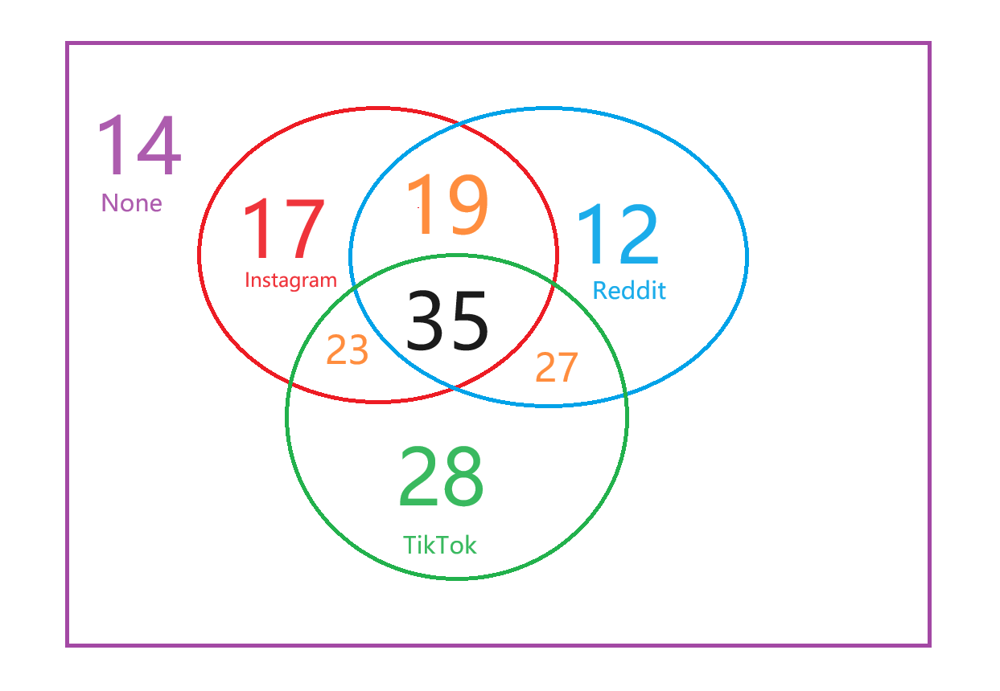

<h1 style="text-align: center;">Mathematical Foundations of Data Science Assignment 2</h1>

### Trimester 2，2024
### Dongju Ma

## Q1
* (a)
To arrange the labourers into 5 groups of 3, we should pick 3 random guys from the origin 15 people, then 3 random guys from the 12 people left, etc. So the expression of this process should be:
$$
\frac{\binom{15}{3} \times \binom{12}{3} \times \binom{9}{3}\times \binom{6}{3} \times \binom{3}{3} }{5!}
$$
which equals 1401400.  
And the each team should have different task with others, we should multiple the result before with all the permutions the assign ways have, which is 
$$
1401400\times5!\times4!\times3!\times2!\times1!
$$
which equals 16816800

* (b)
Now they would be performing the same tasks, we should just divide the labourers to 5 diffrent groups. The permution in each group doesn't count and the permution of groups also doesn't count, so we can just use combination of 15 taken 3 to times tne combination of 15-3=12 taken 3 and so on till  the combination of 3 taken 3. Which is important is because of the permution of th3 combinations also doesn't count so we would divide by 5!  
The expression is:
$$
\frac{\binom{15}{3} \times \binom{12}{3} \times \binom{9}{3}\times \binom{6}{3} \times \binom{3}{3} }{5!}
$$
which equals 1401400.

## Q2
* (a)  
The Venn diagram is below:  

* (b)  
* i. The probability of who uses Reddit is 
$$
\frac{12+27+35+19}{14+17+19+35+23+28+27+12}=\frac{93}{175}\approx0.554
$$
* ii The probability of who uses at least one platform is
$$
\frac{175-14}{175}=\frac{23}{25}=0.92
$$

* iii Suppose the probability of who doesn't uses Instagram is $P(A)$, the probability of who uses TikTok is $P(B)$. So who does not use Instagram given that they use TikTok is $P(A|B)$
So we can learn
$$
P(A|B) = \frac{P(A \cap B)}{P(B)} = \frac{28+27}{28+27+35+23} \approx 0.487 
$$

## Q3
* (a) The probability of five are all diamonds is
$$
\frac{C(13,5)}{C(52,5)} \approx 0.000495
$$

* (b) The probability of five are the same suit is
$$
\frac{C(13,5)\times C(4,1)}{C(52,5)} \approx 0.00198
$$

* (c) There are only 4 circumstances of Royal Flush happening, which is the cards with 4 different suits. So, the probability would be:
$$
\frac{4}{C(52,5)} \approx 1.54\times10^{-6}
$$